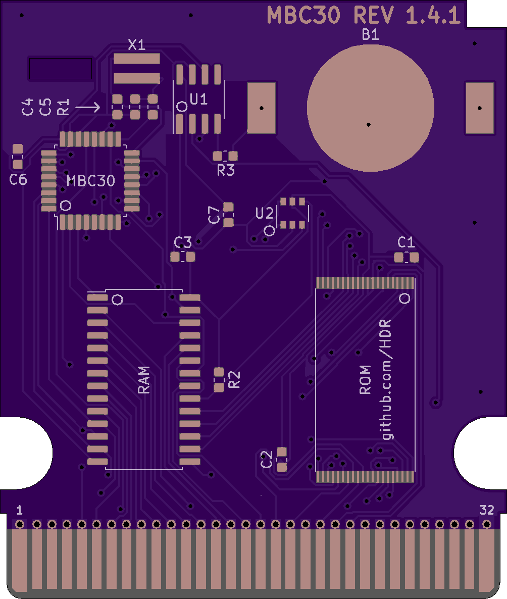

MBC30 Flashcart based on retroreboot's cartridge that uses 0603 components and has added support for 4MB roms

**OSHPark:** 

[Regular Version](https://oshpark.com/shared_projects/gYZqSNHK)

[Crystal Clear Version](https://oshpark.com/shared_projects/PXoETnab)

Make sure to select the "2 oz copper, 0.8mm thickness" option before checkout

**JLCPCB:**

Upload gerbers(.zip files) to [JLCPCB](http://jlcpcb.com)

Make sure you order with the following settings:

PCB Thickness: 0.8

PCB Color: Any

Surface Finish: ENIG-RoHS

Gold Fingers: Yes (45° chamfered border)

Castellated Holes: No

## BOM

| Reference        | Part Number           | Description  |
| ------------- |:-------------:| -----:|
| B1 | BK-6219-TR | CR2025 Coin Cell Retainer |
| C1 | 06033C104KAT4A | 0.1uF Capacitor |
| C2 | 06033C104KAT4A | 0.1uF Capacitor |
| C3 | 06033C104KAT4A | 0.1uF Capacitor |
| C4 | CL10C150JB8NNNC | 15pF Capacitor |
| C5 | CL10C150JB8NNNC | 15pF Capacitor |
| C6 | 06033C104KAT4A | 0.1uF Capacitor |
| C7 | 06033C104KAT4A | 0.1uF Capacitor |
| RAM | FM18W08 | 256kbit FRAM |
| R1 | ERJ-PA3J334V | 330K Ω Resistor |
| R2 | ERJ-PA3J103V | 10K Ω Resistor |
| R3 | ERJ-PA3J102V | 1K Ω Resistor |
| MBC30 | MBC30 | Get from real cartridge |
| U1 | BA6129AF | Buy or get from real cartridge |
| U2 | 74LVC1G332GV,125 | 3-input OR gate TSOP-6 |
| ROM | AM29F016 (2MB), AM29F032 (4MB) or MBM29F033C (4MB) | 2MB or 4MB Rom Chip TSOP-48 or TSOP-40 |
| Y1 | R26-32.768-12.5-10PPM | R26 12.5pF 32.768 kHz Crystal |

Note: Capacitors and Resistor part numbers are suggestions, you can use other components with matching specs

## Images

**Changelog:**

**1.1:**

- Rewired WE on the ROM chip to Pin 31 on the cart bus to fix an issue where it would not write to a bank.

**1.2:**

- Changed the PCB to fit inside Japanese Pokemon Crystal shells
- Added inverted silkscreen to the board to make it look more like the original
